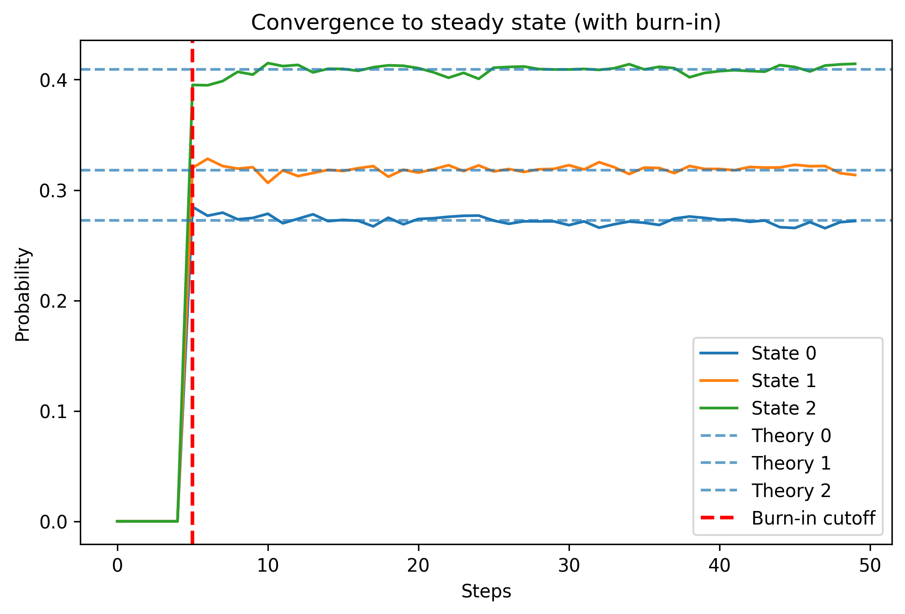
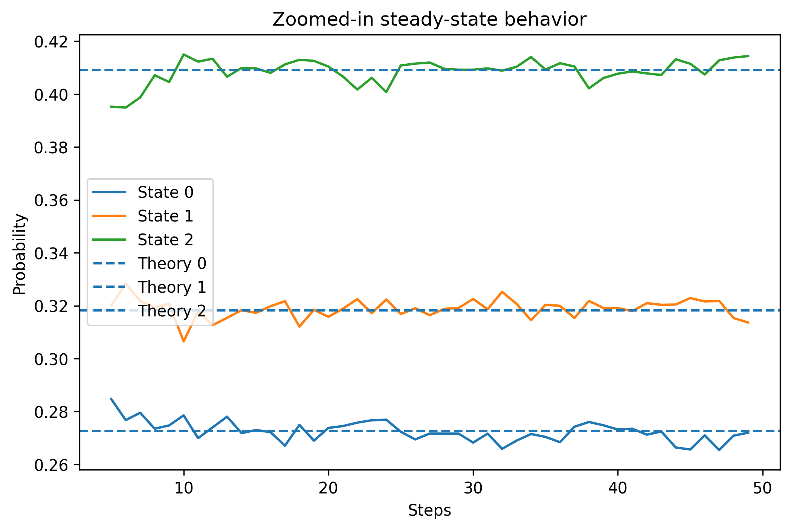
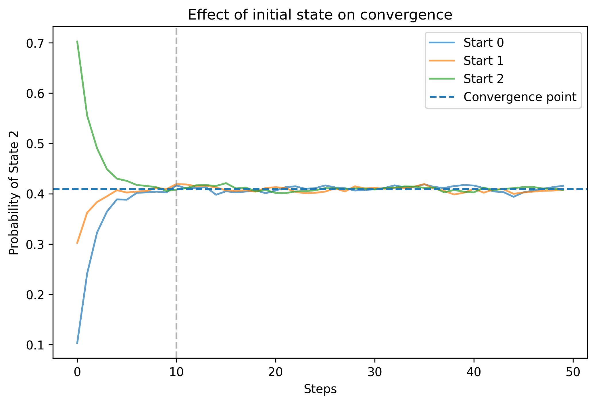
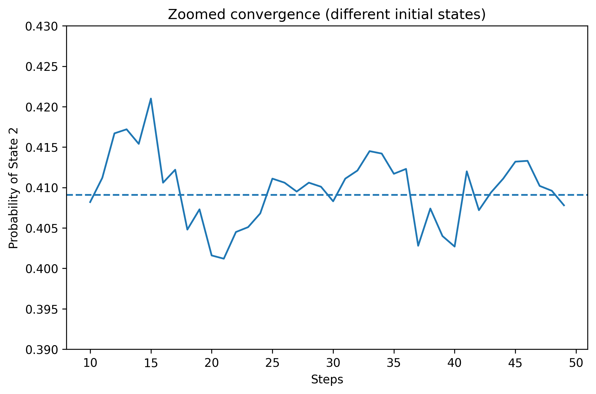

# 📊 Markov Chain Simulation and Convergence Analysis

## 📌 Overview
This project explores the long-run behavior of a Markov chain using both analytical methods and simulation. The objective is to study convergence to a steady-state distribution, examine the effect of initial conditions, and validate theoretical results through computational experiments.

---

## ⚙️ Methods

Three approaches were used:

- **Matrix method**: computing \( aP^k \)
- **Steady-state equation**: solving \( \pi P = \pi \)
- **Simulation**: sampling random transitions over multiple runs

These methods are compared to understand convergence behavior and long-run stability.

---

## 📈 Results

### 1. Convergence to Steady State

The system converges from transient behavior to a steady-state distribution. The dashed vertical line indicates the burn-in period.

---

### 2. Zoomed Steady-State Behavior

After convergence, the system fluctuates slightly around equilibrium due to randomness but remains centered at theoretical values.

---

### 3. Effect of Initial Conditions

Different initial states lead to different short-term behavior, but all trajectories converge to the same steady-state distribution.

---

### 4. Zoomed Initial-State Convergence

After convergence, trajectories overlap closely, showing that the long-run behavior is independent of initial conditions.

---

## 🧠 Key Insights

- Markov chains may converge to a **steady-state distribution** depending on their properties
- Long-run behavior can be **independent of initial conditions**
- Simulation results closely match **analytical predictions**
- Observed fluctuations are due to **stochastic variability**
- The **burn-in period** captures early transient effects

---

## 📂 Project Structure
markov-chain-convergence/
│
├── markov_simulation.ipynb
├── Markov_Chain_Convergence_Report.pdf
│
└── plots/
    ├── 01_convergence_main.png
    ├── 02_convergence_zoom.png
    ├── 03_initial_state_effect.png
    ├── 04_initial_state_zoom.png

---

## 🚀 How to Run

1. Open the notebook:

markov_simulation.ipynb

2. Run all cells to:
- reproduce simulations  
- regenerate plots  
- verify results  

---

## 📌 Notes

This is a **self-initiated project** focused on applying concepts from probability and linear algebra to understand system behavior. The emphasis is on combining theory, simulation, and visualization to analyze convergence properties.

---
